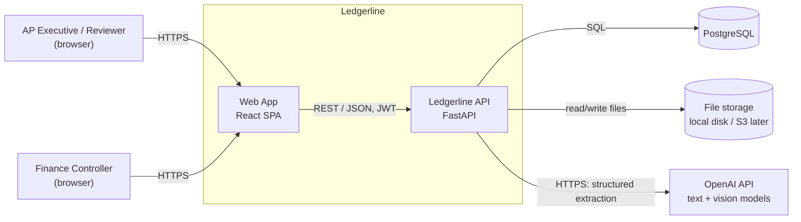
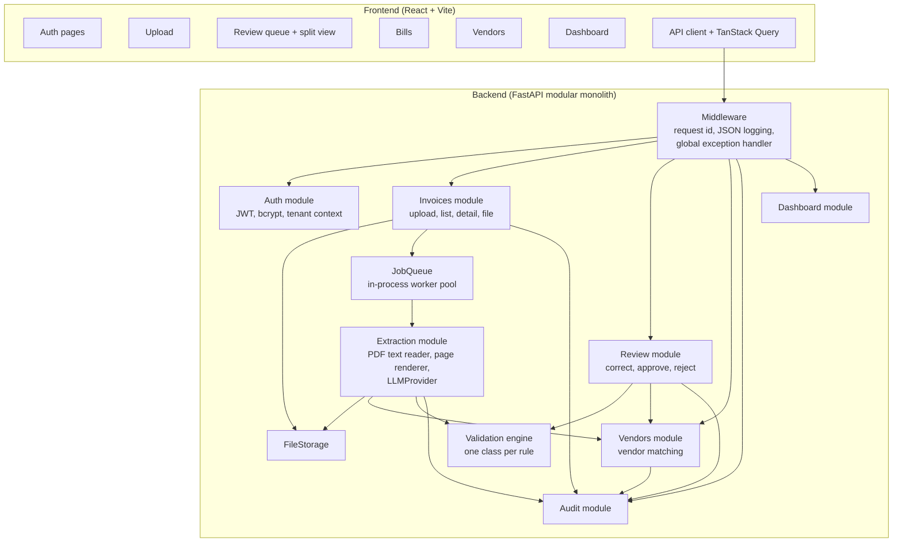
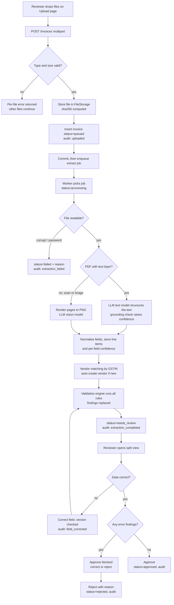
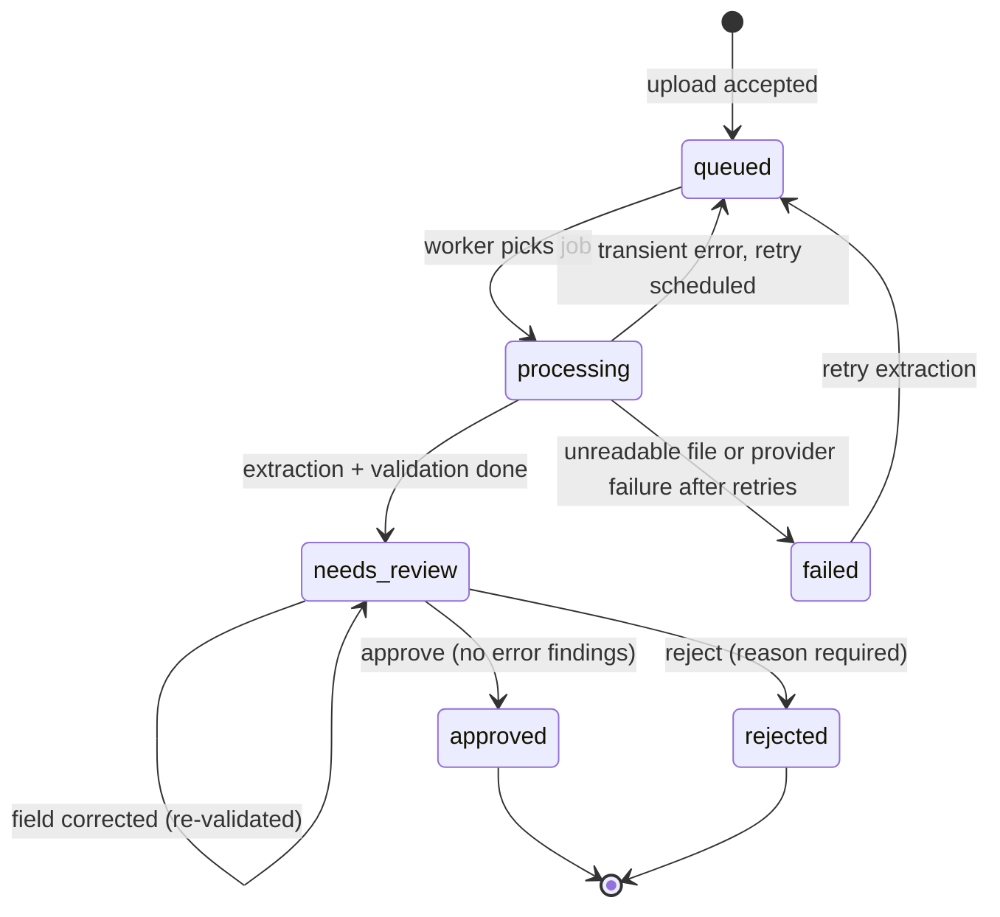
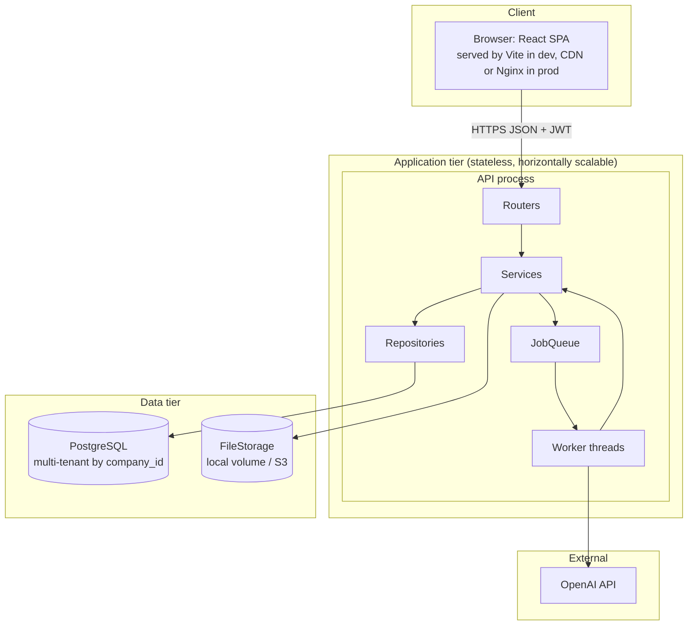
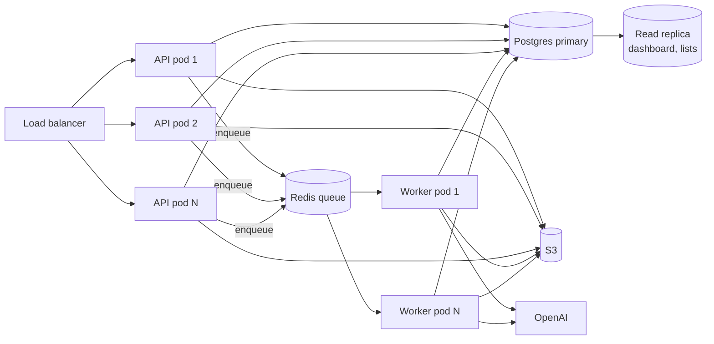

# Ledgerline - High-Level Design

Related: [PRD](01-prd.md) | [LLD](03-lld.md) | [Technical architecture](04-technical-architecture.md)

## 1. System context

External dependencies:

| System | Purpose | Failure impact |
|--------|---------|----------------|
| OpenAI API | Turns invoice text or images into structured fields | New uploads wait in the retry and backoff loop, then go to `failed` (retryable). Review of existing bills is unaffected. |
| PostgreSQL | All business data and the audit trail | Full outage. Health check fails. |
| File storage | Original invoice documents | Previews and new extractions fail. Data stays intact. |

## 2. Main components

| Component | Responsibility |
|-----------|----------------|
| **Auth** | Sign-up (creates company + admin), login, JWT issue and verify, and building the `TenantContext` (company id + user id) for every request. |
| **Invoices** | Accepts uploads, checks size and type, stores the file, creates the bill row (`queued`), enqueues the extraction job, and serves list, detail, and file streams. |
| **Extraction** | Worker-side pipeline: open file -> detect encryption or corruption -> read text layer -> choose text or vision path -> call `LLMProvider` -> normalise -> grounding confidence -> persist. |
| **Validation engine** | Runs every registered `ValidationRule` against a bill and stores findings. Stateless apart from the duplicate lookup port. |
| **Vendors** | Matches a bill to a vendor by GSTIN, auto-creating the vendor on first sight. Lists and edits vendors. |
| **Review** | Field corrections (with optimistic locking), re-validation, approve, and reject. |
| **Audit** | Append-only event log. Writes happen inside the caller's transaction. Serves the timeline. |
| **Dashboard** | Aggregate queries: KPIs, monthly spend, and top vendors. |
| **JobQueue** | Interface for background work. The MVP runs `InProcessJobQueue` (a thread pool) and can switch to a Redis queue later. |
| **FileStorage** | Interface over document storage. The MVP runs `LocalFileStorage`, with S3 later. |

## 3. How components talk

| From | To | Mechanism | Notes |
|------|----|-----------|-------|
| Browser | API | HTTPS REST/JSON, `Authorization: Bearer <JWT>` | Multipart for uploads. Blob download for previews. |
| API routes | Services | In-process calls through FastAPI DI | Services get repositories and other services through the constructor. |
| Services | Postgres | SQLAlchemy session (one per request or job) | One transaction per use case. Audit events go in the same transaction. |
| Invoices service | Job queue | `JobQueue.enqueue("extract_invoice", {invoice_id, company_id})` | Enqueued **after** commit, so the worker always sees the row. |
| Worker | Extraction service | Direct call inside a worker thread with its own DB session | The worker sets the tenant context from the job payload. |
| Extraction | OpenAI | HTTPS through the `LLMProvider` interface | Structured outputs (JSON schema), timeout, retry. |
| Frontend | API (status) | Polling every 2 s while any bill on screen is `queued` or `processing` | Swappable for SSE or WebSocket later. |

## 4. Data flow: upload to approval

### Bill lifecycle

## 5. High-level architecture

**Target (scaled) architecture.** The same code, with the worker moved out of process. See [Technical architecture section 8](04-technical-architecture.md#8-scaling-horizontally).

## 6. Key quality attributes

| Attribute | How it is achieved |
|-----------|--------------------|
| **Tenant isolation** | `company_id` comes from the JWT. Tenant-scoped repositories filter every query. Composite indexes lead with `company_id`. Covered by tests. |
| **Correctness of money** | `NUMERIC(14,2)` and `Decimal` end to end. Strings in JSON. |
| **Auditability** | Append-only `audit_events`, written in the same transaction as the change. |
| **Resilience** | Background jobs with retry and backoff. Durable status in the DB. Re-enqueue on restart. |
| **Swappability** | `LLMProvider`, `JobQueue`, and `FileStorage` interfaces. |
| **Observability** | JSON logs with request id and tenant. Consistent error envelope carrying `request_id`. |
