# Ledgerline - Low-Level Design

Related: [HLD](02-hld.md) | [Technical architecture](04-technical-architecture.md) | [Edge cases](06-edge-case-analysis.md)

Contents
1. [Layering rules](#1-layering-rules)
2. [Domain model class diagram](#2-domain-models)
3. [Repository layer](#3-repository-layer)
4. [Service layer](#4-service-layer)
5. [Extraction, LLM provider and job queue](#5-extraction-llm-provider-and-job-queue)
6. [Validation engine](#6-validation-engine)
7. [API layer](#7-api-layer)
8. [Database ERD, columns, keys and indexes](#8-database)
9. [Sequence diagrams](#9-sequence-diagrams)
10. [Error codes](#10-error-codes)

## 1. Layering rules

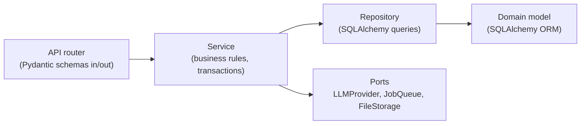

- Routers depend only on services (injected through `Depends`) and Pydantic schemas.
- Services own the transaction boundary (`session.commit()`) and call repositories, ports, and other services.
- Repositories are the only place that builds queries. Tenant repositories are built with a `TenantContext` and always filter by `company_id`.
- Domain models carry no I/O.

## 2. Domain models

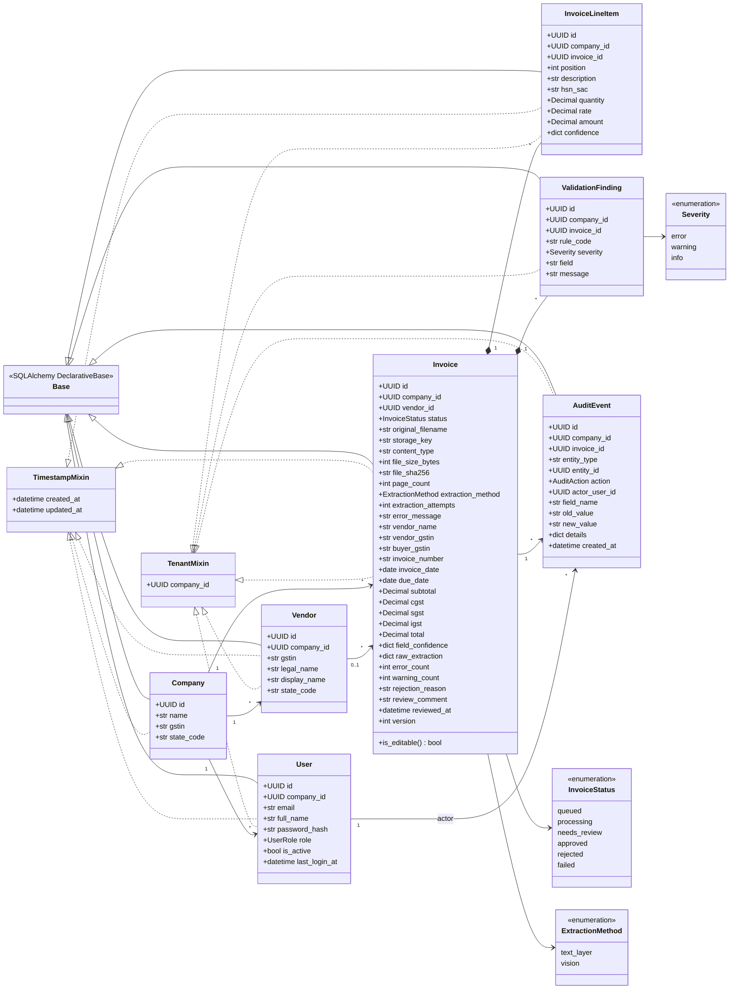

`AuditAction` values: `invoice_uploaded`, `extraction_started`, `extraction_completed`, `extraction_failed`, `extraction_retried`, `vendor_linked`, `vendor_created`, `vendor_updated`, `field_corrected`, `line_item_added`, `line_item_corrected`, `line_item_removed`, `invoice_approved`, `invoice_rejected`.

## 3. Repository layer

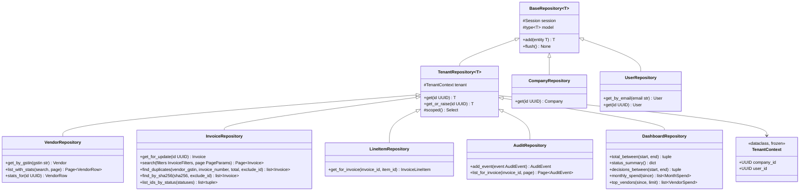

Line items and validation findings are child collections of `Invoice` (`cascade="all, delete-orphan"`), so they are replaced through the aggregate (`invoice.line_items = [...]`, `invoice.findings = [...]`) rather than through their own repositories. `DashboardRepository` is read-only and holds the `TenantContext` directly.

`UserRepository` is deliberately **not** tenant-scoped, because login looks up a user by email before any tenant is known. It is used only by `AuthService` and the auth dependency.

## 4. Service layer

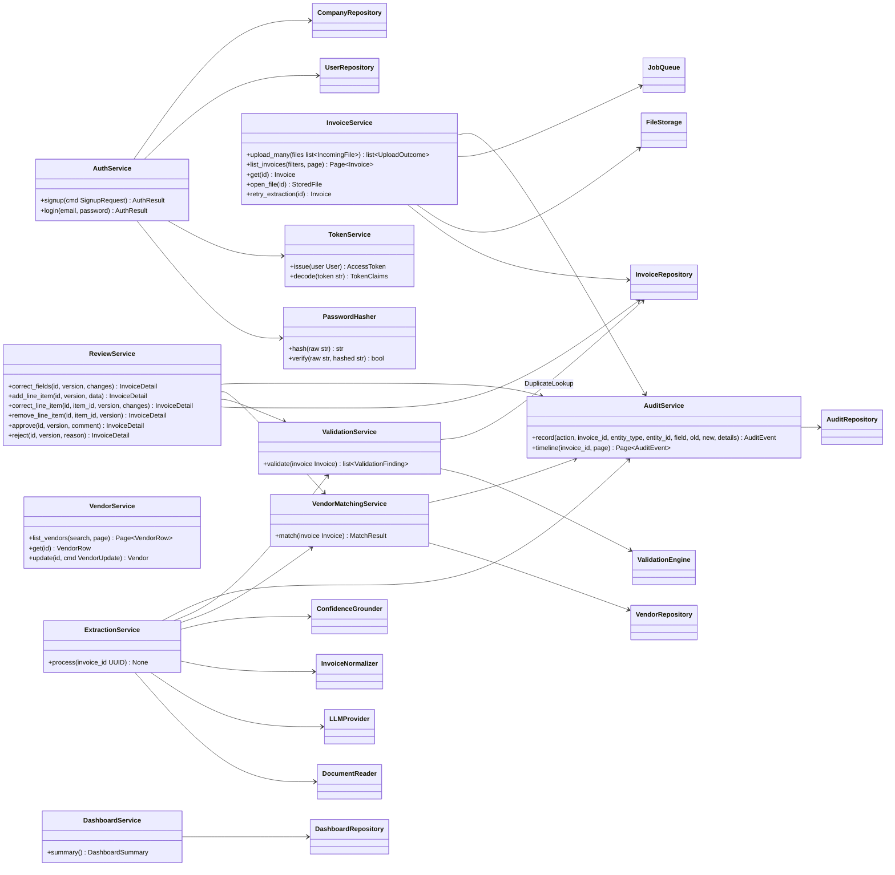

## 5. Extraction, LLM provider and job queue

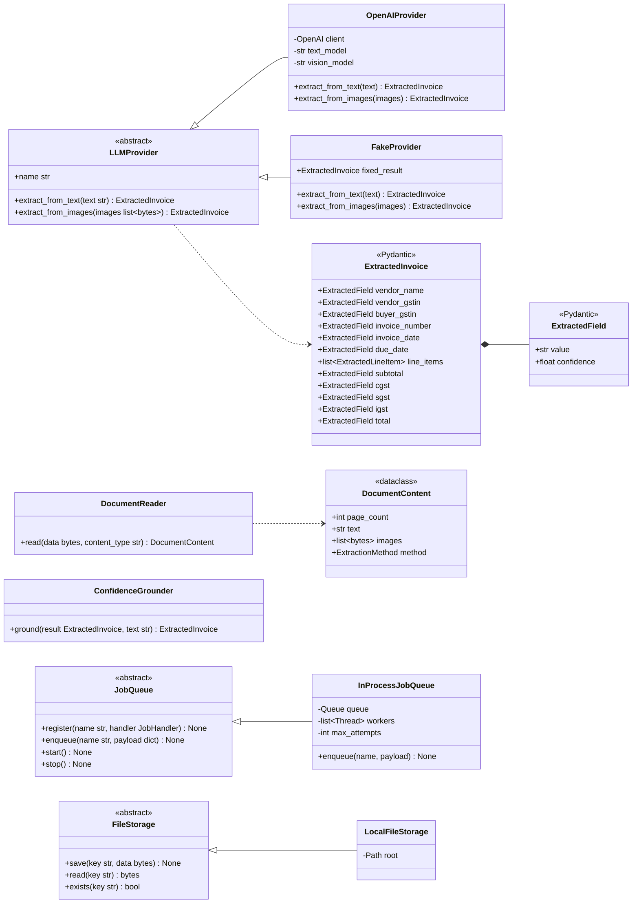

Errors raised by the extraction pipeline:

| Exception | Raised when | Job behaviour |
|-----------|-------------|---------------|
| `UnreadableDocumentError` | Corrupt PDF, undecodable image, zero pages | No retry. Bill set to `failed` with the reason. |
| `PasswordProtectedDocumentError` | PDF is encrypted and the empty password fails | No retry. `failed`, asking for an unlocked copy. |
| `ProviderTransientError` | Timeout, 429, 5xx, connection error | Retried with backoff (D-049). `failed` after the last attempt. |
| `ProviderPermanentError` | Auth error, invalid request, unparseable output | No retry. `failed`. |

## 6. Validation engine

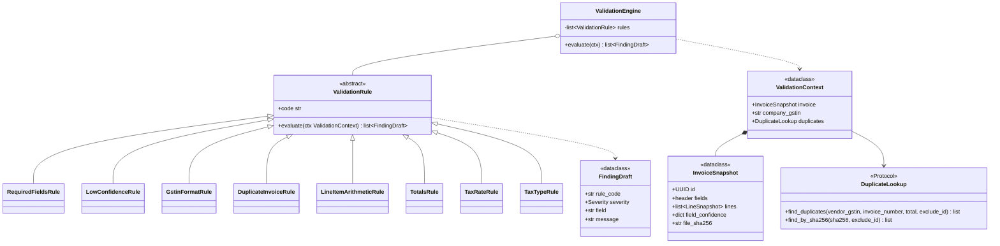

| Rule (code) | Checks | Severity |
|-------------|--------|----------|
| `required_fields` | vendor name, vendor GSTIN, invoice number, invoice date, and total are present. Due date and buyer GSTIN are present. At least one line item. | error / warning / warning |
| `low_confidence` | Any header field with confidence below 0.60 (D-030) | warning |
| `gstin_format` | 15 chars, pattern `^\d{2}[A-Z]{5}\d{4}[A-Z][1-9A-Z]Z[0-9A-Z]$`, valid state code, mod-36 checksum. The buyer GSTIN should equal the company GSTIN when one is set. | error (vendor) / error (buyer format) / warning (buyer not your company) |
| `duplicate_invoice` | An **earlier** non-rejected, non-failed bill with the same vendor GSTIN + invoice number + total, or the same file SHA-256. Only the later copy is flagged (D-066). | error |
| `line_item_arithmetic` | `qty x rate = amount` per line (within Rs 1). The sum of line amounts equals the subtotal (within Rs 1). | error |
| `totals` | `subtotal + cgst + sgst + igst = total`. A difference of Rs 1 or less is info (round-off). More than that is an error. | error / info |
| `tax_rate` | CGST equals SGST. The effective rate `tax / subtotal` is within 0.1 percentage points of a GST slab (D-028). | error / warning |
| `tax_type` | Vendor state (GSTIN digits 1-2) against place of supply (buyer GSTIN state, else company state). Same state: CGST+SGST and no IGST. Different states: IGST only. | error |

## 7. API layer

All routes are prefixed with `/api/v1`. All except auth and health require `Authorization: Bearer <jwt>`.

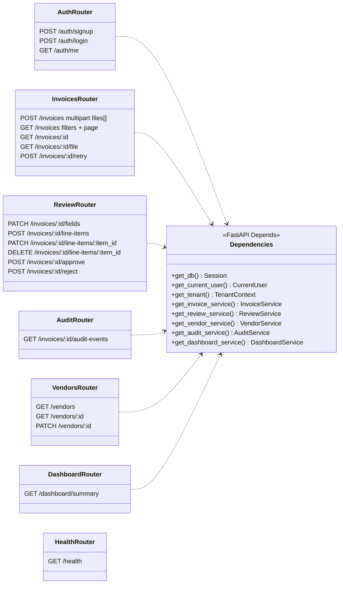

### Key schemas (Pydantic)

| Schema | Fields |
|--------|--------|
| `SignupRequest` | `company_name`, `company_gstin?`, `full_name`, `email`, `password` (min 8) |
| `LoginRequest` | `email`, `password` |
| `AuthResponse` | `access_token`, `token_type`, `expires_at`, `user: UserOut`, `company: CompanyOut` |
| `InvoiceListParams` | `status?` (repeatable), `vendor_id?`, `date_from?`, `date_to?`, `min_total?`, `max_total?`, `search?`, `ids?`, `sort` (`created_at`, `invoice_date`, `total`, `due_date`; prefix `-` for descending), `page`, `page_size` |
| `InvoiceSummaryOut` | id, status, filename, vendor (id, display name), invoice number, dates, total, error and warning counts, created_at |
| `InvoiceDetailOut` | All header fields + `field_confidence` + `line_items[]` + `findings[]` + `version` + reviewer info |
| `FieldCorrectionRequest` | `version`, `changes: [{field, value}]`. `field` is an enum of editable header fields. |
| `LineItemCorrectionRequest` | `version`, `changes: [{field, value}]` where field is description, hsn_sac, quantity, rate, or amount |
| `ApproveRequest` / `RejectRequest` | `version`, `comment?` / `version`, `reason` (3-1000 chars) |
| `Page[T]` | `items`, `page`, `page_size`, `total`, `total_pages` |
| `ErrorResponse` | `error: {code, message, details?, request_id}` |

## 8. Database

### 8.1 Entity relationship diagram

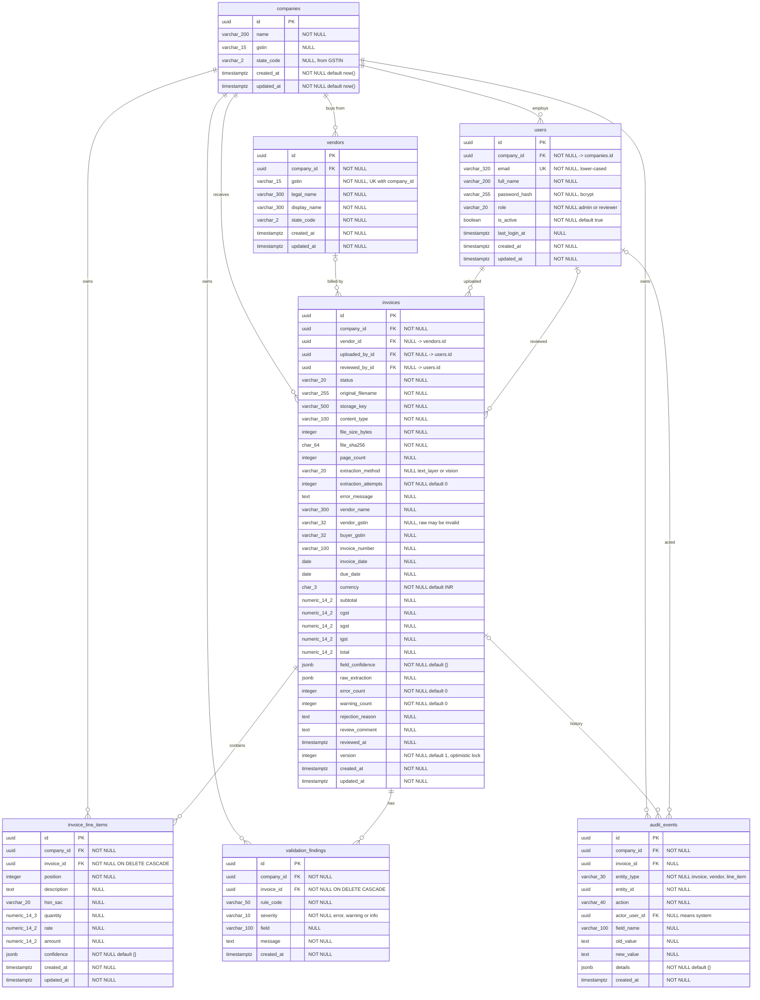

### 8.2 Keys, constraints and indexes

| Table | Constraint / index | Columns | Purpose |
|-------|--------------------|---------|---------|
| companies | PK | `id` | |
| users | PK | `id` | |
| users | `uq_users_email` UNIQUE | `email` | Login lookup. Email is globally unique (one user, one company in the MVP). |
| users | `ix_users_company_id` | `company_id` | List users of a tenant |
| users | FK | `company_id -> companies.id` ON DELETE CASCADE | |
| vendors | PK | `id` | |
| vendors | `uq_vendors_company_gstin` UNIQUE | `company_id, gstin` | Vendor matching. Prevents duplicate vendors under concurrent extraction. |
| vendors | `ix_vendors_company_display_name` | `company_id, display_name` | Sort and search vendor list |
| invoices | PK | `id` | |
| invoices | `ix_invoices_company_status` | `company_id, status` | Review queue filter |
| invoices | `ix_invoices_company_vendor` | `company_id, vendor_id` | Filter by vendor, vendor totals |
| invoices | `ix_invoices_company_invoice_date` | `company_id, invoice_date` | Date range filter, dashboard month |
| invoices | `ix_invoices_company_created_at` | `company_id, created_at` | Default sort |
| invoices | `ix_invoices_company_total` | `company_id, total` | Amount range filter |
| invoices | `ix_invoices_company_due_date` | `company_id, due_date` | Sort by due date |
| invoices | `ix_invoices_company_sha256` | `company_id, file_sha256` | Same-file duplicate check |
| invoices | `ix_invoices_duplicate_key` | `company_id, vendor_gstin, invoice_number` | Duplicate rule lookup |
| invoices | `ck_invoices_status` CHECK | `status IN (...)` | Enum integrity |
| invoices | FKs | `company_id`, `vendor_id` (SET NULL), `uploaded_by_id`, `reviewed_by_id` | |
| invoice_line_items | `ix_line_items_company_invoice` | `company_id, invoice_id, position` | Load lines in order |
| validation_findings | `ix_findings_company_invoice` | `company_id, invoice_id` | Load findings |
| validation_findings | `ix_findings_company_severity` | `company_id, severity` | Future reporting |
| validation_findings | `ck_findings_severity` CHECK | `severity IN ('error','warning','info')` | |
| audit_events | `ix_audit_company_invoice_created` | `company_id, invoice_id, created_at` | Bill timeline |
| audit_events | `ix_audit_company_entity` | `company_id, entity_type, entity_id, created_at` | Vendor or entity history |
| audit_events | `ix_audit_company_created` | `company_id, created_at` | Company-wide activity feed |

## 9. Sequence diagrams

### 9.1 Upload

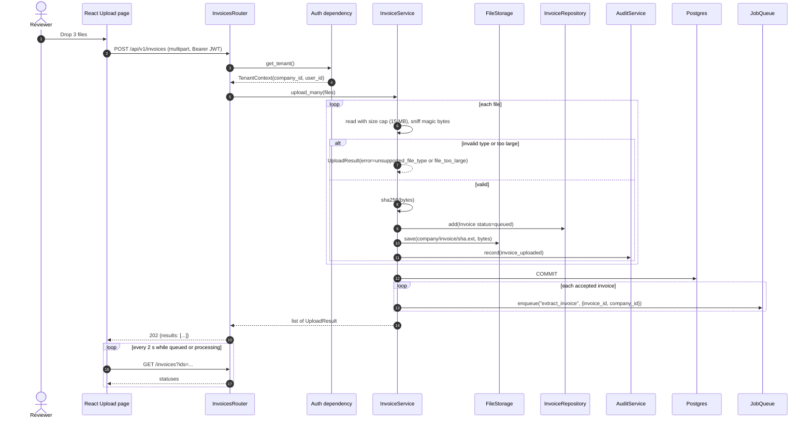

### 9.2 Extraction (background job)

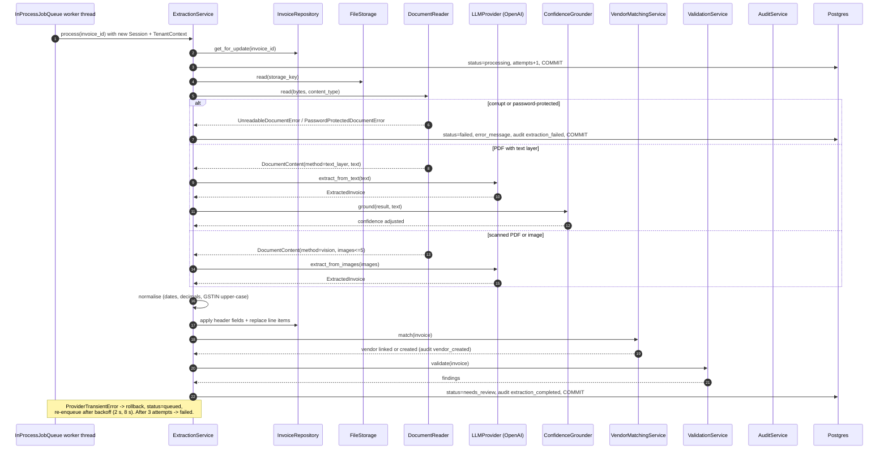

### 9.3 Validation

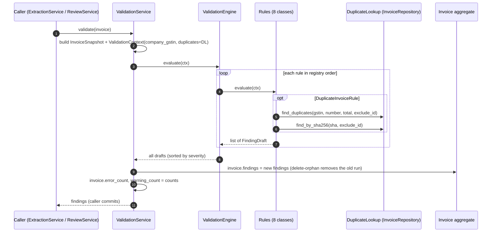

### 9.4 Review action: correct a field, then approve

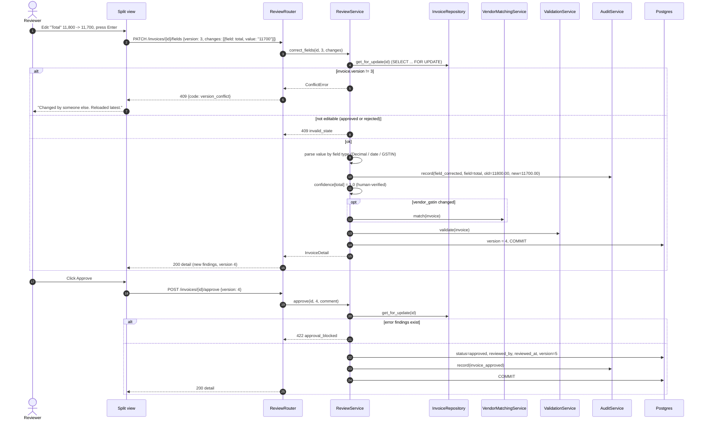

## 10. Error codes

| HTTP | `error.code` | When |
|------|--------------|------|
| 400 | `bad_request` | Malformed input not caught by schema |
| 401 | `not_authenticated` | Missing token |
| 401 | `token_expired` | JWT `exp` in the past |
| 401 | `invalid_token` | Bad signature, malformed token, or the user no longer exists |
| 401 | `invalid_credentials` | Wrong email or password |
| 404 | `not_found` | Entity missing **or belongs to another tenant** (no existence leak) |
| 409 | `email_taken` | Signup with an existing email |
| 409 | `version_conflict` | Optimistic lock failure |
| 409 | `invalid_state` | Editing an approved, rejected, or processing bill. Retrying a non-failed bill. |
| 413 | `file_too_large` | Per-file result. Also returned when the whole request is too large. |
| 415 | `unsupported_file_type` | Per-file result |
| 422 | `validation_error` | Pydantic request validation. `details` lists field errors. |
| 422 | `approval_blocked` | Approve while error findings exist |
| 500 | `internal_error` | Unhandled. Logged with stack trace and request id. |
