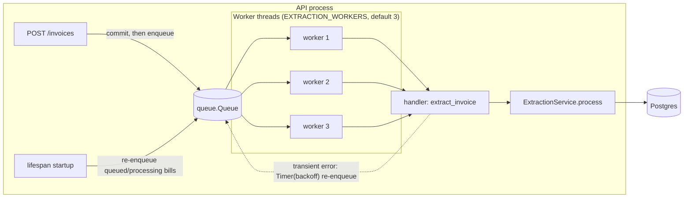
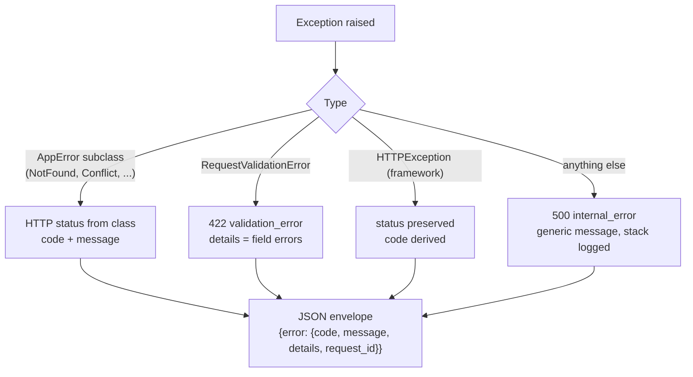
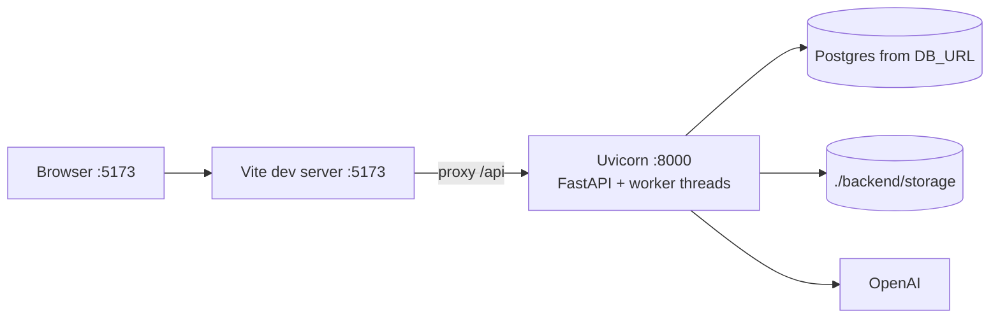

# Ledgerline - Technical Architecture

Related: [HLD](02-hld.md) | [LLD](03-lld.md) | [Decision log](decision-log.md)

## 1. Tech stack and why

### Backend

| Piece | Choice | Why |
|-------|--------|-----|
| Language | Python 3.12 | The best ecosystem for PDF handling and AI SDKs. Team familiarity. Modern typing. |
| Web framework | FastAPI | Type-driven request and response validation through Pydantic, native dependency injection, auto OpenAPI docs, high performance. |
| ORM | SQLAlchemy 2.x (typed `Mapped[]`, sync sessions) | The industry-standard Python ORM. Explicit sessions and transactions. Typed models work with mypy (D-041). |
| DB driver | psycopg 3 (binary) | The maintained successor to psycopg2. Supports SSL (`sslmode=require` on the remote DB). |
| Database | PostgreSQL 14+ | ACID, `NUMERIC` for money, `JSONB` for confidence maps and raw extraction, partial and composite indexes, row-level security available later. |
| Migrations | Alembic | The standard for SQLAlchemy. Versioned, reviewable migrations. |
| Schemas and config | Pydantic v2 + pydantic-settings | A single validation library for API schemas, LLM structured output, and typed settings from env. |
| Auth | PyJWT (HS256) + bcrypt | Small, audited libraries. bcrypt is used directly (passlib is unmaintained). |
| PDF text layer | pypdf | Pure Python. Reads the text layer and detects encryption. |
| PDF rendering for scans | pypdfium2 | Renders PDF pages to images with no system dependencies (no poppler or ghostscript). |
| Images | Pillow | Validates, normalises, and downsizes images before vision calls. |
| LLM | OpenAI Python SDK (`gpt-4.1-mini` text, `gpt-4.1` vision) behind `LLMProvider` | Structured outputs (JSON schema) give typed results. Swappable (D-051, D-054). |
| Server | Uvicorn | The standard ASGI server. |
| Tests | pytest + FastAPI TestClient (httpx) | The standard. Fixtures for DB and dependency overrides. |
| Quality | Ruff (lint + format), mypy (strict on `app/`) | Fast, one tool for lint and format. Static typing catches layer-contract drift. |

### Frontend

| Piece | Choice | Why |
|-------|--------|-----|
| Build | Vite | Fast dev server and build. The standard for new React apps. |
| UI | React 18 + TypeScript (strict) | Team standard. Typing mirrors the API schemas. |
| Routing | React Router 6 | The de facto standard. |
| Server state | TanStack Query 5 | Caching, polling (upload status), invalidation after mutations, retries (D-080). |
| Styling | CSS Modules + `tokens.css` | A single design-token file with no runtime cost (D-081). |
| Charts | Recharts | Simple declarative charts for the dashboard (D-083). |
| Fonts | `@fontsource/inter`, `@fontsource/public-sans` | Self-hosted (D-082). |
| Quality | ESLint (typescript-eslint, react-hooks), Prettier, Vitest | Standard lint, format, and unit test tooling. |

## 2. Folder structure

Feature-based on both sides. Each backend feature owns its models, schemas, repository, service, dependencies, and router.

```text
.
├── README.md
├── docs/                         # PRD, HLD, LLD, architecture, flows, edge cases, decision log
├── samples/                      # Sample invoice PDFs and images for manual upload (generated)
├── backend/
│   ├── pyproject.toml            # deps + ruff + mypy + pytest config
│   ├── alembic.ini
│   ├── alembic/
│   │   ├── env.py
│   │   └── versions/             # migration scripts
│   ├── app/
│   │   ├── main.py               # app factory, lifespan (start/stop job queue), router wiring
│   │   ├── core/                 # cross-cutting: config, db, logging, security, errors, pagination, tenant
│   │   ├── infrastructure/
│   │   │   ├── jobs/             # JobQueue interface + InProcessJobQueue
│   │   │   └── storage/          # FileStorage interface + LocalFileStorage
│   │   ├── features/
│   │   │   ├── auth/             # Company, User, signup/login, JWT dependency
│   │   │   ├── invoices/         # Invoice, LineItem, upload, list, detail, file
│   │   │   ├── extraction/       # DocumentReader, LLM providers, grounding, normaliser, ExtractionService, job
│   │   │   ├── validation/       # Finding model, rules/ (one class per rule), engine, service
│   │   │   ├── vendors/          # Vendor model, matching service, vendor service, router
│   │   │   ├── review/           # ReviewService: correct, approve, reject
│   │   │   ├── audit/            # AuditEvent model, AuditService, timeline router
│   │   │   └── dashboard/        # KPI + spend queries
│   │   └── db/                   # model registry imported by Alembic
│   ├── scripts/
│   │   └── seed_demo.py          # demo company, user, sample invoices
│   └── tests/
│       ├── conftest.py           # test DB, client, auth helpers
│       ├── unit/                 # validation rules, GSTIN, grounding, normaliser, security
│       └── integration/          # services + API (auth, upload, review, tenancy)
└── frontend/
    ├── package.json
    ├── vite.config.ts            # /api proxy to backend
    ├── eslint.config.js
    ├── .prettierrc
    └── src/
        ├── main.tsx
        ├── app/                  # App, router, providers, layout (Sidebar, Topbar, AppShell)
        ├── styles/
        │   ├── tokens.css        # every colour, space, radius, shadow, font size
        │   └── global.css
        ├── components/ui/        # Button, Input, Select, Card, Table, Pager, Modal, Drawer, Toast, Badge, states
        ├── lib/                  # api client, auth storage, formatters (INR lakh format, dates)
        └── features/
            ├── auth/             # Login, Signup, AuthContext, RequireAuth
            ├── invoices/         # shared API hooks + types for bills
            ├── upload/           # drag-and-drop upload page
            ├── review/           # queue + split view (preview, fields, findings, audit timeline)
            ├── bills/            # all bills with filters
            ├── vendors/          # vendor list + edit drawer
            └── dashboard/        # KPI cards + spend chart
```

## 3. Background processing



- **Interface.** `JobQueue.register(name, handler)`, `enqueue(name, payload)`, `start()`, `stop()`. Payloads are JSON-serialisable dicts (`invoice_id`, `company_id`, `attempt`). This is exactly what a Redis-backed implementation needs.
- **In-process implementation.** A `queue.Queue` plus N daemon threads. Each job gets its **own DB session**, and the tenant context is built from the payload (never from a request).
- **Durability.** The queue is in memory, but the bill status in Postgres is durable. At startup, `recover_pending_jobs()` re-enqueues every bill still in `queued` or `processing`, so a restart loses no work (D-048).
- **Retries.** `ProviderTransientError` causes the job to be re-scheduled with a backoff of `2 * 4^(attempt-1)` seconds (2 s, 8 s) up to `EXTRACTION_MAX_ATTEMPTS=3`. After that the bill is `failed` with a retryable message.
- **Idempotency.** The handler loads the bill and exits early unless its status is `queued` or `processing`. Line items and findings are *replaced*, not appended, so re-running is safe.
- **Swap to Redis.** Implement `RedisJobQueue(JobQueue)` (for example with RQ or Arq), set `JOB_QUEUE_BACKEND=redis`, and run `python -m app.worker` as a separate deployment. Services and handlers do not change.

## 4. Configuration and secrets

- **One typed `Settings` class** (`app/core/config.py`, pydantic-settings) reads environment variables and the `.env` file. It fails fast at startup on a missing or invalid value.
- **Secrets** (`OPENAI_API_KEY`, `DB_URL`, `JWT_SECRET`) come only from the environment. They are typed as `SecretStr`, so they never appear in logs or reprs. `.env` is git-ignored, and `.env.example` documents every key.
- In production, inject them through the platform secret manager (AWS Secrets Manager or SSM, GCP Secret Manager, Kubernetes Secrets) as env vars. No code change is needed.
- `JWT_SECRET` must be set outside `development`. In development a random per-process secret is generated with a warning, which means tokens do not survive a restart.

| Variable | Required | Default | Purpose |
|----------|----------|---------|---------|
| `DB_URL` or `DATABASE_URL` | yes | | Postgres URL (`postgresql://` is normalised to psycopg) |
| `OPENAI_API_KEY` | yes for real extraction | | OpenAI key. Without it, `LLM_PROVIDER=fake` is required. |
| `JWT_SECRET` | yes (non-dev) | random in dev | HMAC secret for tokens |
| `APP_ENV` | no | `development` | `development` / `test` / `production` |
| `LLM_PROVIDER` | no | `openai` | `openai` or `fake` |
| `OPENAI_TEXT_MODEL` | no | `gpt-4.1-mini` | Model for text-layer structuring |
| `OPENAI_VISION_MODEL` | no | `gpt-4.1` | Model for scans and images |
| `OPENAI_TIMEOUT_SECONDS` | no | `60` | Per-request timeout |
| `JWT_EXPIRE_MINUTES` | no | `480` | Token lifetime |
| `STORAGE_DIR` | no | `./storage` | Local file storage root |
| `MAX_UPLOAD_MB` | no | `15` | Per-file size limit |
| `MAX_FILES_PER_UPLOAD` | no | `20` | Files per request |
| `EXTRACTION_WORKERS` | no | `3` | Worker threads |
| `EXTRACTION_MAX_ATTEMPTS` | no | `3` | Attempts for transient errors |
| `CORS_ORIGINS` | no | `http://localhost:5173` | Comma-separated list |
| `LOG_LEVEL` | no | `INFO` | |
| `TEST_DATABASE_URL` | tests only | `postgresql+psycopg://localhost/ledgerline_test` | Separate DB for pytest |

## 5. Logging

- **Format.** One JSON object per line on stdout:
  `{"timestamp":"2026-10-04T10:12:01.532Z","level":"INFO","logger":"app.extraction","message":"extraction completed","request_id":"9f2c...","company_id":"...","user_id":"...","invoice_id":"...","method":"text_layer","duration_ms":4210}`
- **Context.** Middleware generates (or accepts) an `X-Request-ID`, stores it with the tenant ids in `contextvars`, and echoes it in the response header. Worker jobs set `job_id`, `invoice_id`, and `company_id`.
- **Access log.** One line per request with method, path, status, and duration in ms.
- **Never logged.** Passwords, tokens, API keys, raw invoice contents. Only ids and metadata are logged.
- **Levels.** `INFO` for business events (upload, extraction done, approve). `WARNING` for retries and blocked actions. `ERROR` for failures, with the stack trace.

## 6. Error handling



- Domain errors live in `app/core/exceptions.py`: `AppError(code, message, status_code, details)` with subclasses `NotFoundError`, `ConflictError`, `VersionConflictError`, `InvalidStateError`, `AuthenticationError`, `TokenExpiredError`, `ValidationFailedError`, `ApprovalBlockedError`, `PayloadTooLargeError`, `UnsupportedMediaTypeError`.
- Services raise domain errors. They never raise `HTTPException`. Routers do not catch.
- Unhandled exceptions return a generic 500 with no leaked internals, and are logged with the `request_id`, which is also returned to the client for support.
- The frontend has one `ApiError` class that maps `error.code` to UX. `token_expired` and `invalid_token` clear the session and redirect to `/login?next=...`. `version_conflict` reloads the bill and shows a toast.

## 7. Security summary

| Concern | Control |
|---------|---------|
| Passwords | bcrypt, cost 12. A minimum of 8 characters. |
| Tokens | HS256 JWT. Claims: `sub` (user id), `cid` (company id), `exp`, `iat`. Verified on every request. The user is re-loaded so deactivated users are rejected. |
| Tenancy | `company_id` from the token only. Tenant repositories. 404 (not 403) for other tenants' ids. |
| Uploads | Size cap enforced while reading. Magic-byte type check. Stored outside the web root under a generated name (never the user's filename). |
| CORS | An explicit origin allow-list. |
| SQL injection | The ORM uses bound parameters. Search uses `ILIKE` with escaped wildcards. |
| Secrets | `SecretStr`, env only, `.env` git-ignored. |

## 8. Scaling horizontally

The MVP runs as one process, but nothing in it prevents scaling out:

1. **Stateless API.** No sessions in memory. JWTs are self-contained. Run N API replicas behind a load balancer.
2. **Split workers.** Switch to `JOB_QUEUE_BACKEND=redis` and run dedicated worker pods sized for OpenAI concurrency. API pods only enqueue.
3. **Shared file storage.** Replace `LocalFileStorage` with an `S3FileStorage`, so any pod can read any document. Serve previews through short-lived signed URLs.
4. **Database.** Use connection pooling (PgBouncer), and a read replica for dashboard and list queries. Every index leads with `company_id`, so large tenants can later be partitioned by hash of `company_id` (or moved to dedicated databases) with no query changes.
5. **Rate limits.** A token-bucket limiter per tenant in Redis on the upload and OpenAI call paths. A per-tenant queue fairness key stops one tenant's bulk upload from starving others.
6. **Real-time status.** Replace polling with Server-Sent Events backed by Redis pub/sub.
7. **Defence in depth.** Enable Postgres row-level security with `SET app.company_id` per session.

## 9. Local development topology


