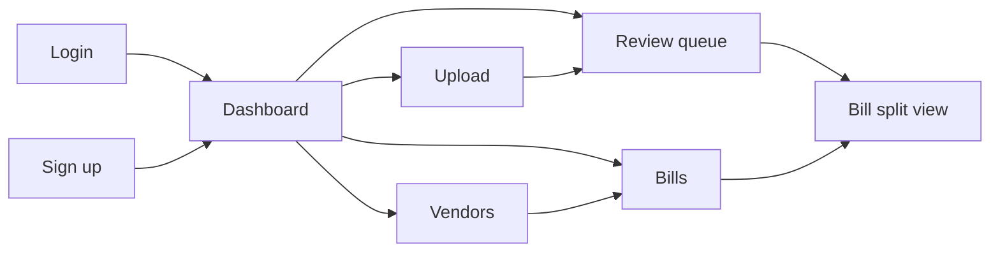
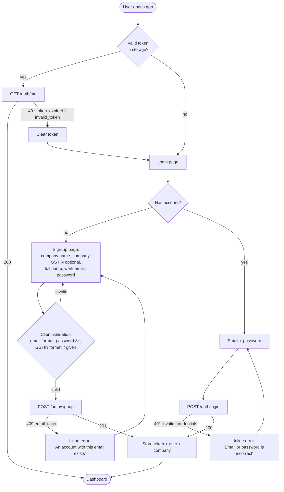
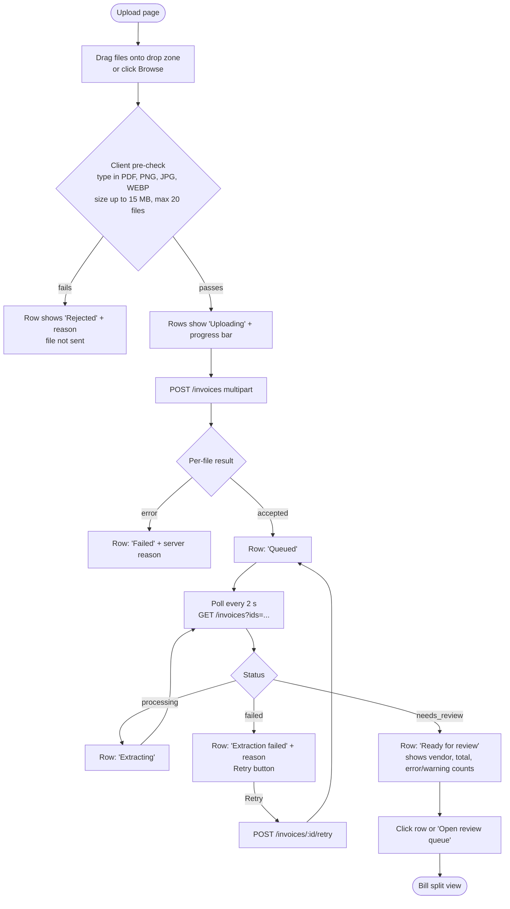
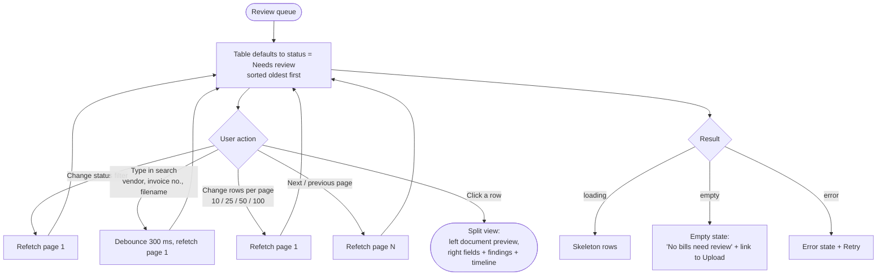
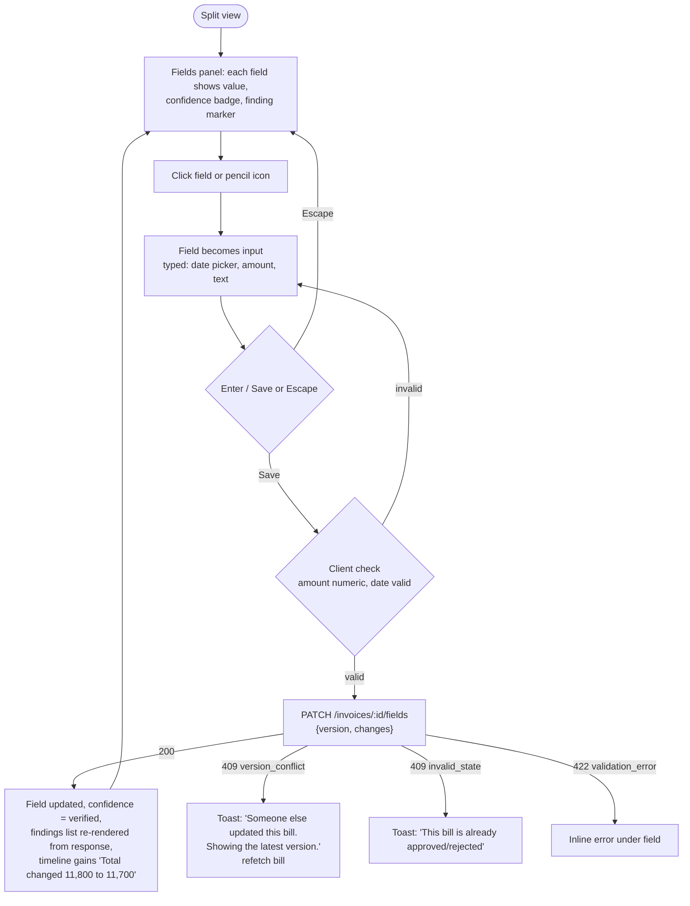
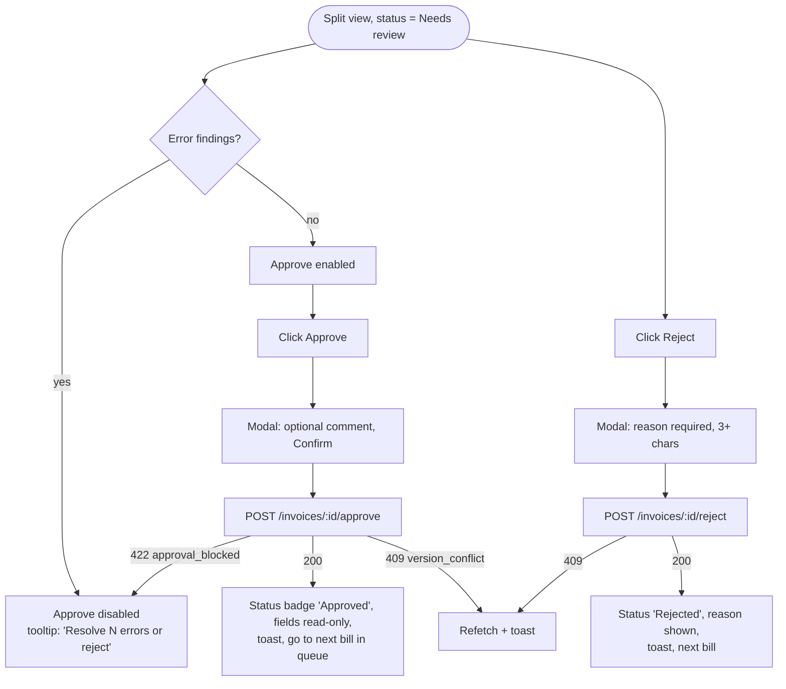
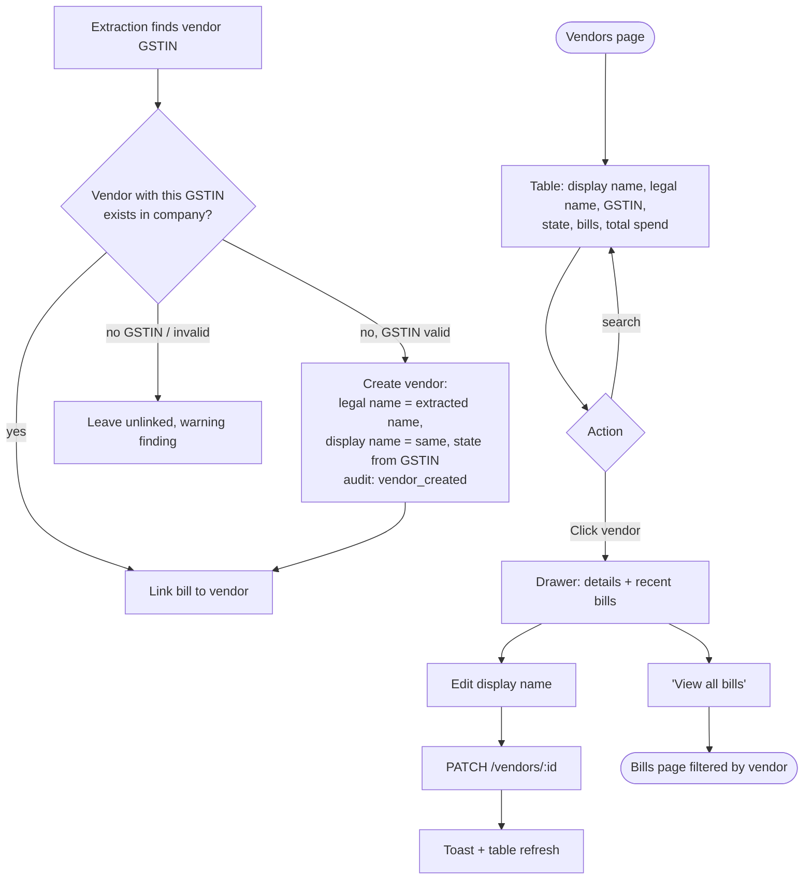
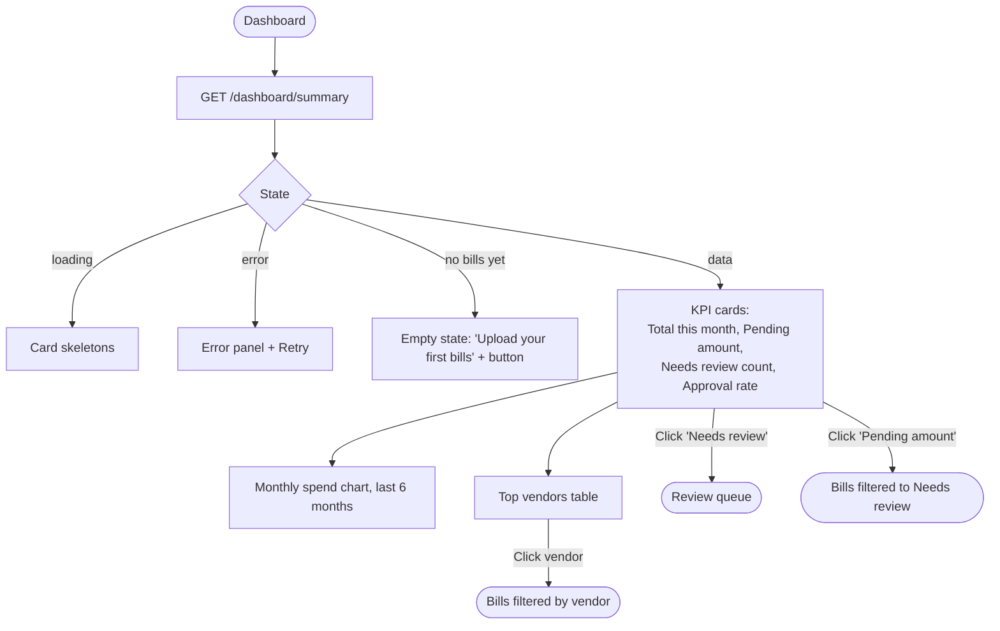

# Ledgerline - User Flows

Related: [PRD](01-prd.md) | [HLD](02-hld.md)

Navigation map (left sidebar): **Dashboard**, **Upload**, **Review queue**, **Bills**, **Vendors**. The top bar shows the company name and the user menu (name, email, sign out).

## 1. Sign-up and login

## 2. Uploading invoices

## 3. Review queue

## 4. Correcting a field

## 5. Approving or rejecting

## 6. Vendor management

## 7. Dashboard

